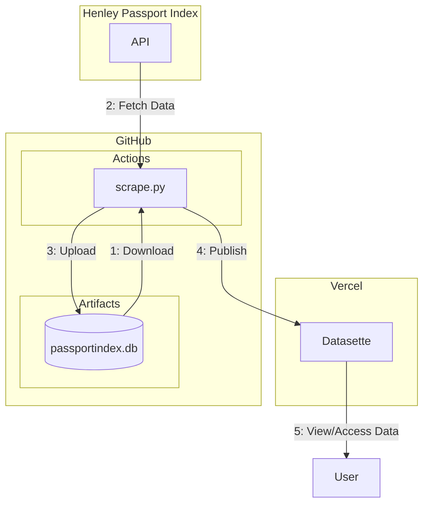
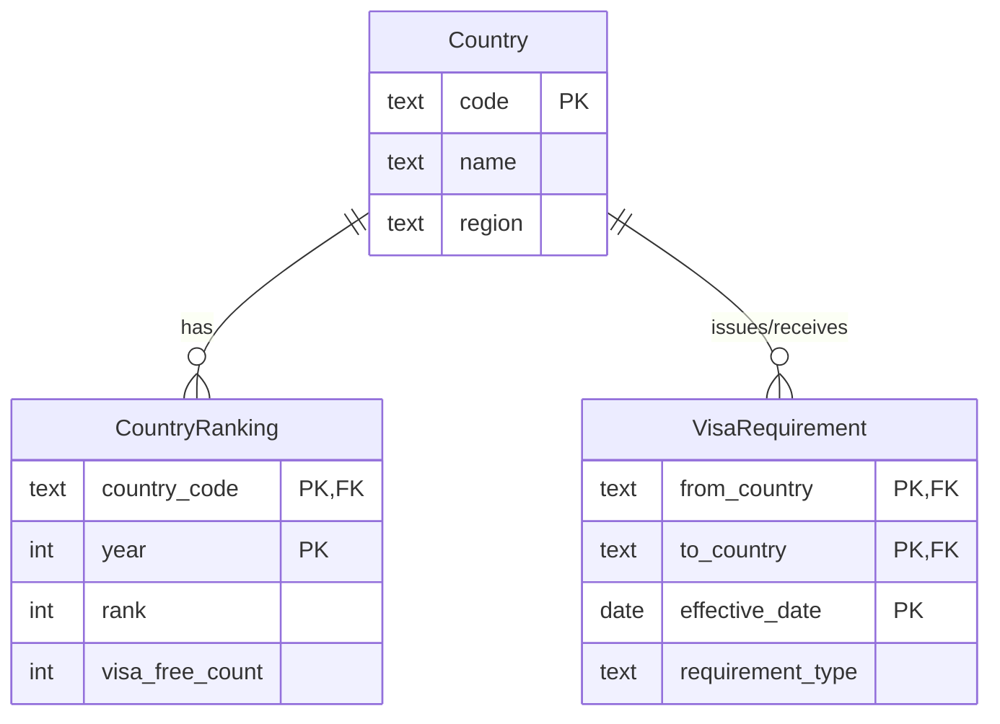

# Passport DB

Tracking historical changes in passport rankings and visa requirements.

## How This Works



## Database Schema



## Usage

### Running the Script

To run the script locally and update the database:

```bash
python3 scrape.py
```

## License

This project is licensed under the [MIT License](./LICENSE).

## Disclaimer

This software is only used for research purposes, users must abide by the relevant laws and regulations of their location, please do not use it for illegal purposes. The user shall bear all the consequences caused by illegal use.
