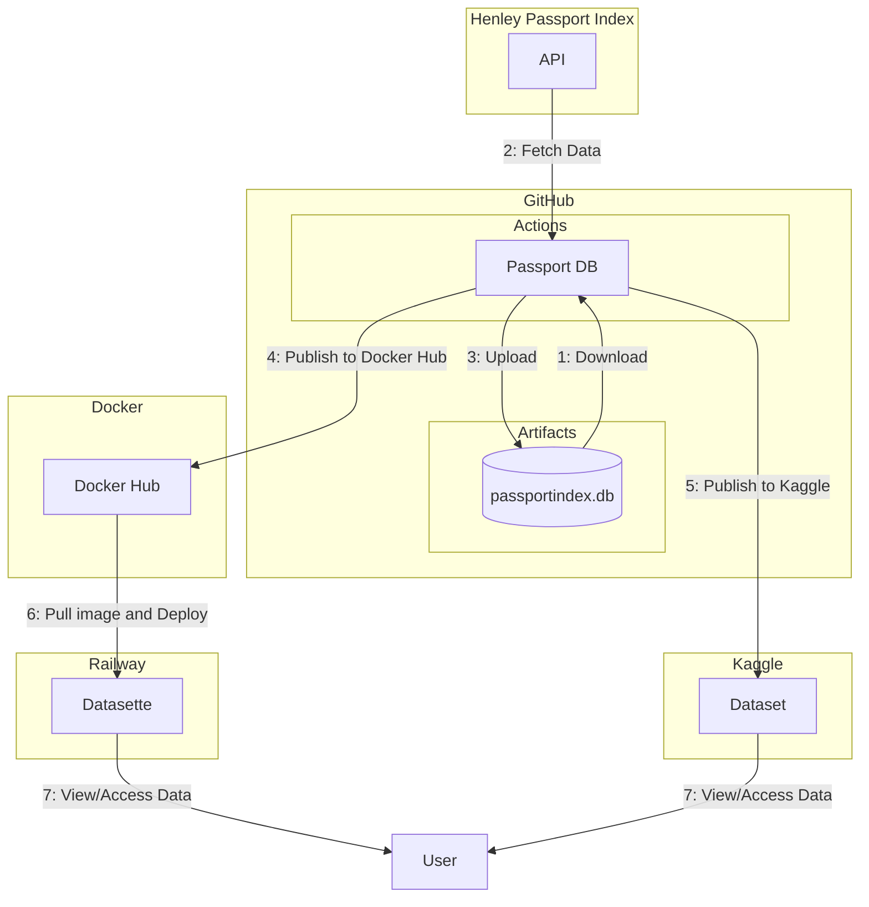
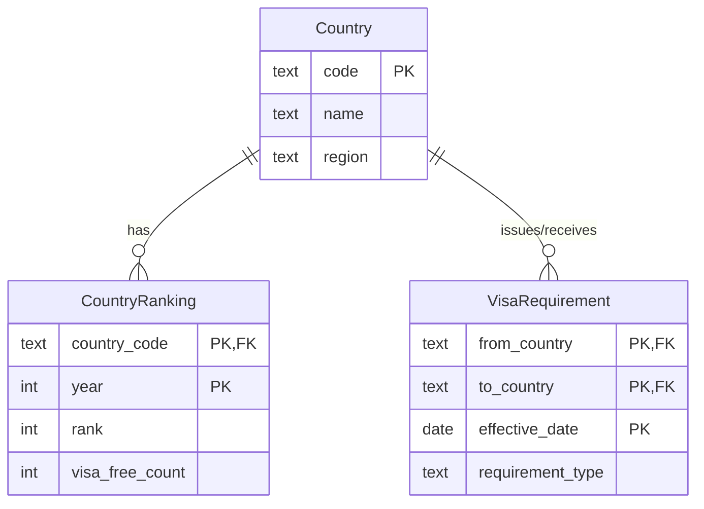

# Passport DB

Tracking historical changes in passport rankings and visa requirements.

[Read more...](https://jerrynsh.com/i-built-a-visa-requirement-change-tracker-for-fun/)

## How This Works


```mermaid
graph TB
    subgraph Railway
        deployment[Datasette]
    end
    subgraph GitHub
        subgraph Actions
            scraper[Passport DB]
        end
        subgraph Artifacts
            db[(passportindex.db)]
            class db artifacts;
        end
    end
    subgraph Henley Passport Index
        api[API]
    end
    subgraph Docker
        dockerhub[Docker Hub]
    end
    subgraph Kaggle
        kaggle[Dataset]
    end
    db --> |1: Download| scraper
    api --> |2: Fetch Data| scraper
    scraper --> |3: Upload| db
    scraper --> |4: Publish to Docker Hub| dockerhub
    scraper --> |5: Publish to Kaggle| kaggle
    dockerhub --> |6: Pull image and Deploy| deployment
    deployment --> |7: View/Access Data| client[User]
    kaggle --> |7: View/Access Data| client[User]
```

## Database Schema


```mermaid
erDiagram
    Country ||--o{ CountryRanking : has
    Country ||--o{ VisaRequirement : "issues/receives"

    Country {
        text code PK
        text name
        text region
    }

    CountryRanking {
        text country_code PK, FK
        int year PK
        int rank
        int visa_free_count
    }

    VisaRequirement {
        text from_country PK, FK
        text to_country PK, FK
        date effective_date PK
        text requirement_type
    }
```

## Usage

### Running the Script

To run the script locally and update the database:

```bash
python3 scrape.py
```

To upload the generated data/ to Kaggle (uses kaggle/dataset-metadata.json and kaggle/kernel-metadata.json):

```bash
pip install kaggle
export KAGGLE_API_TOKEN=foobar
export KAGGLE_USERNAME=foobar
python3 export_kaggle.py
```

## License

This project is licensed under the [MIT License](./LICENSE).

## Disclaimer

This software is only used for research purposes, users must abide by the relevant laws and regulations of their location, please do not use it for illegal purposes. The user shall bear all the consequences caused by illegal use.
