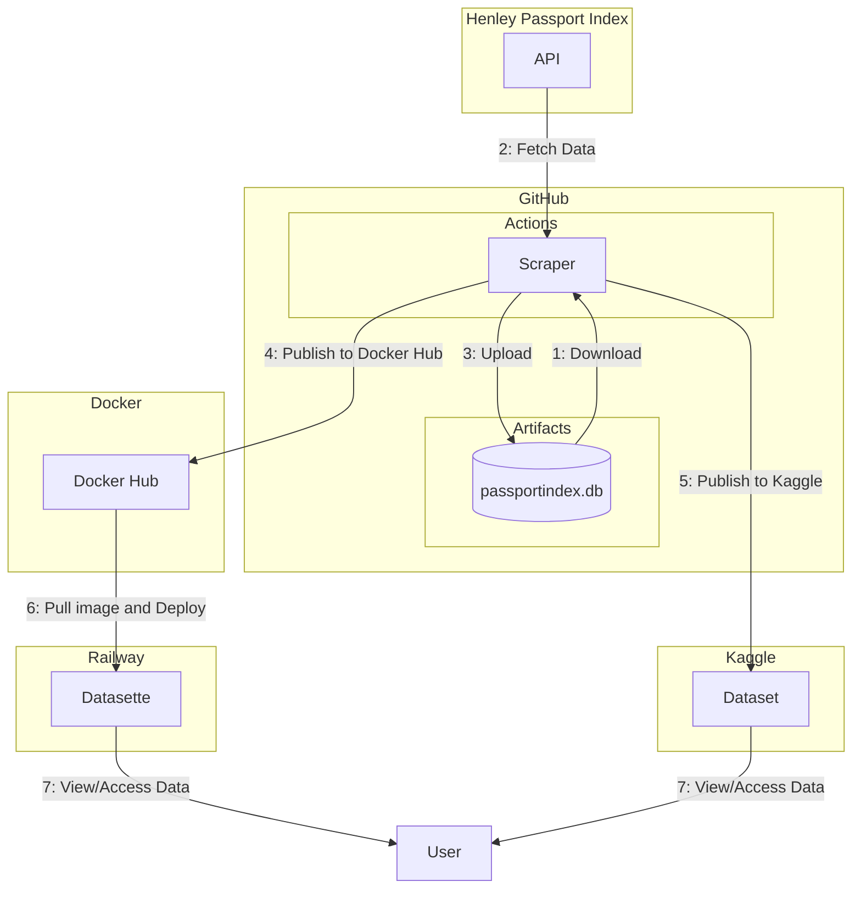
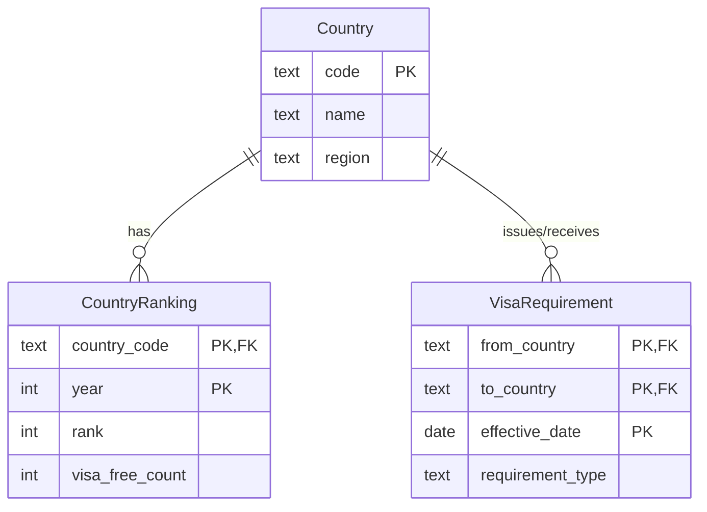

# Passport Index DB

Tracking historical changes in passport rankings and visa requirements.

[Read more...](https://jerrynsh.com/i-built-a-visa-requirement-change-tracker-for-fun/)

## How This Works


```mermaid
graph TB
    subgraph Railway
        deployment[Datasette]
    end
    subgraph GitHub
        subgraph Actions
            scraper[Scraper]
        end
        subgraph Artifacts
            db[(passportindex.db)]
            class db artifacts;
        end
    end
    subgraph Henley Passport Index
        api[API]
    end
    subgraph Docker
        dockerhub[Docker Hub]
    end
    subgraph Kaggle
        kaggle[Dataset]
    end
    db --> |1: Download| scraper
    api --> |2: Fetch Data| scraper
    scraper --> |3: Upload| db
    scraper --> |4: Publish to Docker Hub| dockerhub
    scraper --> |5: Publish to Kaggle| kaggle
    dockerhub --> |6: Pull image and Deploy| deployment
    deployment --> |7: View/Access Data| client[User]
    kaggle --> |7: View/Access Data| client[User]
```

## Database Schema


```mermaid
erDiagram
    Country ||--o{ CountryRanking : has
    Country ||--o{ VisaRequirement : "issues/receives"

    Country {
        text code PK
        text name
        text region
    }

    CountryRanking {
        text country_code PK, FK
        int year PK
        int rank
        int visa_free_count
    }

    VisaRequirement {
        text from_country PK, FK
        text to_country PK, FK
        date effective_date PK
        text requirement_type
    }
```

## Usage

```sh
❯ make
Welcome to passportindexdb [development].
Use make <target> where <target> is one of:

Helper
  help             display this help message.

Usage
  run              run scraper.
  inspect          generate inspect file for performance optimization.
  datasette        run datasette with optimizations.
  test             run unit tests.

Docker
  docker-build     build datasette docker image.
  docker-push      build and push docker images to registry.

Kaggle
  kaggle-export    export Kaggle dataset CSVs into data/ directory.
  kaggle-push      export and upload dataset to Kaggle.

Contributing
  setup-dev        install development dependencies including required Datasette plugins
```

## License

This project is licensed under the [MIT License](./LICENSE).

## Disclaimer

This software is only used for research purposes, users must abide by the relevant laws and regulations of their location, please do not use it for illegal purposes. The user shall bear all the consequences caused by illegal use.
